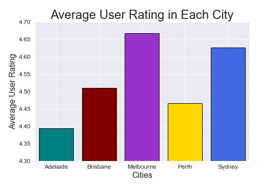

# Zomato Restaurants Reviews #

Group project:
- Ashley Drayton
- Babette Blanquet 
- Benedict Nathaniel 
- Erica Wearne

In this project, our goal is to understand how Melbourne's restaurants compare to Australians' restaurants.

## Hypothesis, questions and overall findings: ##

**Our hypothesis are:**
- Melbourne is the cultural epicentre of Australia and renowned for the quality and diversity of its food.
- Melbourne has the best restaurants amongst the five largest cities in Australia.

**Question:**
Does Melbourne really have the best restaurants in Australia based on price, ratings and diversity of cuisines?

**Key findings:**
Melbourne has the highest rated restaurants however it comes at a higher price.

## The Data Exploration and The Data Clean-up ##

The code for the data exploration and data cleaning in the Jupyter Notebook named: "Zomato_data_exploration_and_cleaning_"

**Data Sources**
- We used Zomato API to gather the data
- Our dataset included 500 restaurants which is the combination of the Top 100 restaurants of Melbourne, Sydney, Brisbane, Adelaide, Perth
**Challenges**
- We wanted 1000 restaurants per city but the limitation of 100 restaurants maximum per call.
- Even though we could get around this constraint by searching for multiple postcodes, we worked with the central postcodes due to time contraints.
**Biases**
- By choosing only the five cities, this excluded possibly excellent restaurants in rural areas of Australia butwe were interested in the best restaurants where most Australians live.

**The Data Clean-up**
- The data is saved to a .csv
- we removed the duplicates with .dropna()
- removed incorrect cells by sorting the data, then removing incorrect values
- sorted the data by user ratings to extract the top 100 restaurants in Australia

## The Data Analysis ##

The code with the data analysis is in the Jupyter Notebook named: "Zomato_Restaurants_Analysis"

**Restaurant Distribution and Average User Rating**

- 44% of the Top 100 Restaurants are in Melbourne.

- When we look at the Top 500 restaurants, Melbourne is just ahead on average user ratings than Sydney.

**User ratings across top 500 restaurants in each city**
- Melbourne and Sydney have a slightly higher ratings than other cities among their Top 100 restaurants.
- This makes sense has they also are much bigger cities than the others.

**Cost Comparison Across the Cities**
- Melbourne is significantly more expensive than in any other city
- Melbourne outlying restaurants don’t explain the high average cost

**Cuisines and cities**
- The Japanese and Italian cuisines are the most represented among the top restaurants.
- The variety of cuisines is roughly the same across all cities. 

## Summary and Conclusion ##

- 44% of the Top 100 restaurants are located in Melbourne.
- Melbourne’s average cost for two people is significantly higher than other city in Australia.
- Generally, cuisines are evenly diverse across the five cities.

**Conclusion**
Melbourne has the highest rated restaurants however it comes at a higher price.

## Challenges ##

**Challenges** 
- Higher average cost in Melbourne’s top restaurants can be potentially skewed by factors such as the dining scene, target demographics, paid marketing, etc. Zomato IS after all for-profit.
- Top 100 doesn’t adequately represent the dining scene in Australia – heavily favoured by Melbourne.
- Zomato categorisation includes multiple terms that may convolute the data exploration process, may cause categorical disparity.
- Broad vs specific categorisation.
- What we took is a “snapshot”, not accurately representing the thousands of other restaurants in those cities.

**If we had 2 more weeks...**
- We would look at a larger number of restaurants and assess grouping more thoroughly.
- Look at other APIs and do further validation - perhaps more public ones such as Google Maps and Foursquare APIs.

--------------------------------------------------------------------------
Please note you will find in the folder named 'Final notebooks':
- two notebooks, one for the Data Exploration and Data Cleaning and one for the Data Analysis
- the folder with "outputdata" with csv files
- the folder with "images"  where we saved the graphs of our analysis
- the PowerPoint presentation

Thank you.
#Teal Rabbits Team
